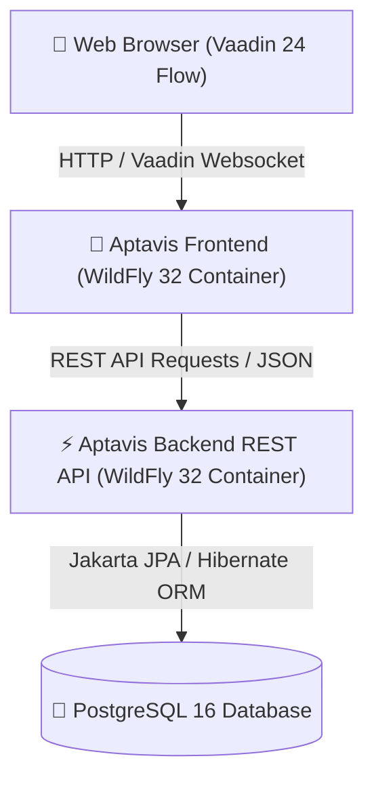

# 🚀 Aptavis - Modern Project Tracker

[](https://aptavis-frontend.onrender.com)
[](https://aptavis.onrender.com/rest/projects)
[](https://openjdk.org/projects/jdk/21/)
[](https://jakarta.ee/)
[](https://vaadin.com/)
[](https://www.postgresql.org/)

---

## 🌐 Live Application Links

- **🎨 Frontend Application (Vaadin Web UI):** [https://aptavis-frontend.onrender.com](https://aptavis-frontend.onrender.com)

---

## 📌 Overview

**Aptavis Project Tracker** is a full-stack enterprise web application built for seamless project and task management. It combines a clean, reactive frontend UI built with **Vaadin 24 & SCSS** with a robust enterprise backend powered by **Jakarta EE 10 (JAX-RS, JPA/Hibernate, CDI)** running on **WildFly 32** and backed by a **PostgreSQL 16** database deployed on Cloud Infrastructure.

---

## ✨ Features

- **📂 Project Management:** Create, view, edit, search, and delete projects.
- **✅ Task Tracking & Weighting:** Assign tasks to projects with customizable weights (effort levels) and statuses (`DRAFT`, `IN_PROGRESS`, `DONE`).
- **📊 Automatic Progress Metrics:** Real-time dynamic calculation of project completion percentage derived from weighted task completion ratios.
- **🔄 Auto Status Transitions:** Intelligent project status management (`DRAFT`, `IN_PROGRESS`, `DONE`) based on active task states.
- **🔍 Quick Search & Filter:** Lazy instant search across projects and tasks.
- **🎨 Glassmorphism & Modern SCSS Design:** Custom design system built with SASS/SCSS tokens, responsive grid cards, interactive modal dialogs, and toast notifications.
- **🐳 Multi-Stage Containerization:** Enterprise Docker multi-stage builds separating compilation from WildFly runtime execution.

---

## 🏗️ Architecture & Technology Stack



### **Tech Stack**
- **Frontend:** Java 21, Vaadin 24 Flow, Jakarta CDI, SCSS (Dart Sass CLI)
- **Backend:** Java 21, Jakarta EE 10 (JAX-RS / RESTEasy, Jakarta Persistence / Hibernate 6, CDI)
- **Application Server:** WildFly 32.0.1.Final (JDK 21)
- **Database:** PostgreSQL 16
- **Build & DevOps:** Apache Maven, Docker (Multi-stage), Render Cloud Hosting

---

## 📂 Project Structure

```text
aptavis/
├── aptavis-backend/                # Enterprise Backend Service
│   ├── src/main/java/              # JAX-RS Application, Services, Repositories, Domain Models
│   ├── src/main/resources/         # persistence.xml & schema.sql
│   ├── src/main/webapp/WEB-INF/    # jboss-web.xml (Context Root Configuration)
│   └── Dockerfile                  # Multi-stage Dockerfile for Backend Deployment
├── aptavis-frontend/               # Reactive Vaadin UI Frontend Service
│   ├── frontend/styles/            # SCSS source stylesheets & compiled CSS tokens
│   ├── src/main/java/              # Vaadin Views, Dialogs, Cards & REST API Clients
│   ├── src/main/webapp/WEB-INF/    # jboss-web.xml (Context Root Configuration)
│   └── Dockerfile                  # Multi-stage Dockerfile for Frontend Deployment
├── schema.sql                      # SQL Schema & Seed Data Initialization
├── docker-compose.yml              # Local Multi-Container Development Stack
└── pom.xml                         # Root Maven Multi-Module Project Object Model
```

---

## 🛠️ Local Development & Setup

### Prerequisites
- **JDK 21** or later
- **Apache Maven 3.9+**
- **PostgreSQL 16** (or Docker)

### 1. Clone Repository
```bash
git clone https://github.com/wafikhn/aptavis.git
cd aptavis
```

### 2. Configure Environment Variables (`.env`)
Create a `.env` file in the project root:
```env
POSTGRES_HOST=localhost
POSTGRES_DB=projecttracker
POSTGRES_USER=postgres
POSTGRES_PASSWORD=postgres
BACKEND_API_URL=http://localhost:8080/rest
```

### 3. Run with Docker Compose
```bash
docker-compose up --build
```
- Access Frontend: `http://localhost:8081`
- Access Backend API: `http://localhost:8080/rest/projects`

---

## 📄 License & Author

Created & Maintained by **Wafi** ([@wafikhn](https://github.com/wafikhn)).  
Built with ❤️ using Java 21, Jakarta EE 10, and Vaadin 24.
